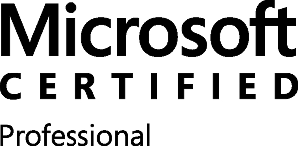

  
   
  

# 👋 Hi, I'm Hendi Dwi Purwanto

### 💻 Senior .NET Backend Engineer | ASP.NET Core | Clean Architecture | 10+ Years

Backend engineer with 10+ years building and maintaining enterprise web 
applications on the .NET platform. I've worked with distributed teams 
across Singapore 🇸🇬, Australia 🇦🇺, the US 🇺🇸, and Indonesia 🇮🇩 — 
delivering backend systems used in real operational environments across 
finance, mining, e-commerce, and healthcare.

---

## 🚀 Current Focus
- Building backend systems with ASP.NET Core and Clean Architecture
- REST API development and authentication (Keycloak SSO, RBAC, JWT)
- Developing Shayangkoeh Bakery E-Commerce as a side project

---

## 🛠 Tech Stack

### 🧩 Backend

### 🎨 Frontend (Supporting)

### 🛢️ Database

### ☁️ DevOps & Tools

### 🧱 Architecture

---

## 🧠 Highlight Projects

### 🔐 [Enterprise Order System API](https://github.com/hendidwipurwanto/aspnetcore-clean-architecture-enterprise-api)
> ASP.NET Core · Clean Architecture · JWT · Refresh Token Rotation · SQL Server  
Production-ready backend API with secure authentication and 
role-based access control.

### 🔑 [Keycloak SSO Integration](https://github.com/hendidwipurwanto/aspnetcore-keycloak-sso-mvc)
> ASP.NET Core MVC · Keycloak · RBAC · Clean Architecture  
Enterprise SSO implementation with OpenID Connect and 
role-based authorization.

### 📘 [Flying Cape Education Platform](https://www.flyingcape.com.sg/)
> ASP.NET Core Web API · SQL Server  
Led .NET 4.5 to .NET Core migration. Integrated payment gateway 
for education-based e-commerce.

---

## 📈 GitHub Stats

---

## 🧩 Certifications
- Microsoft® Certified Professional
- Microsoft® Specialist: Programming in C#
- Microsoft® Specialist: Programming in HTML5 with JavaScript and CSS3

---

## 📫 Connect With Me

📧 hendi.dp@gmail.com

---

_"Write code that's easy to maintain, not just easy to write."_
